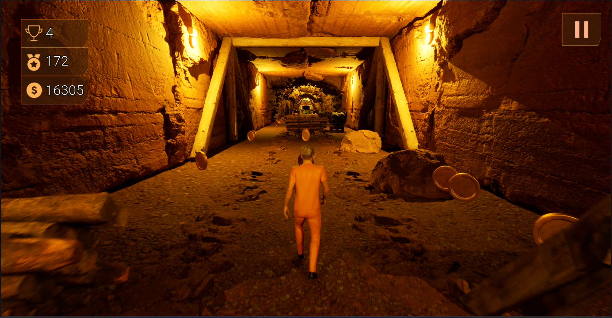
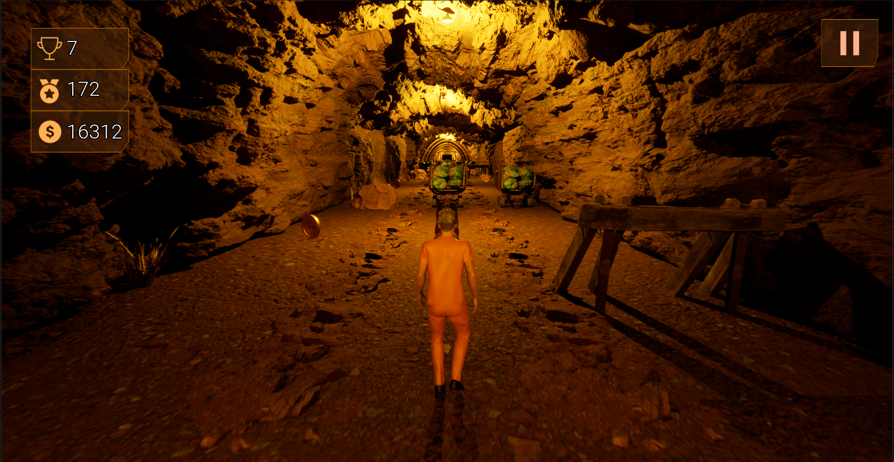
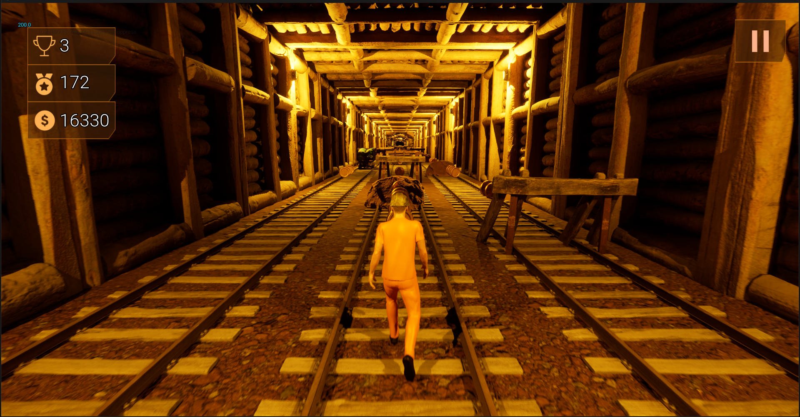
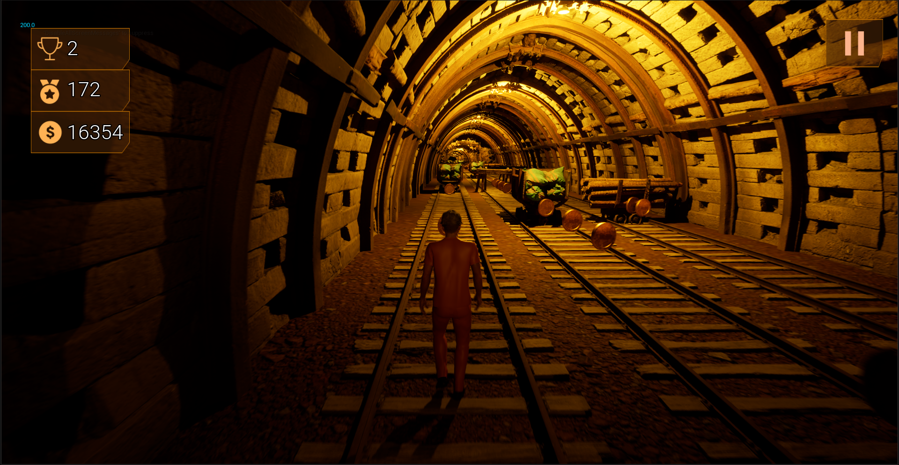
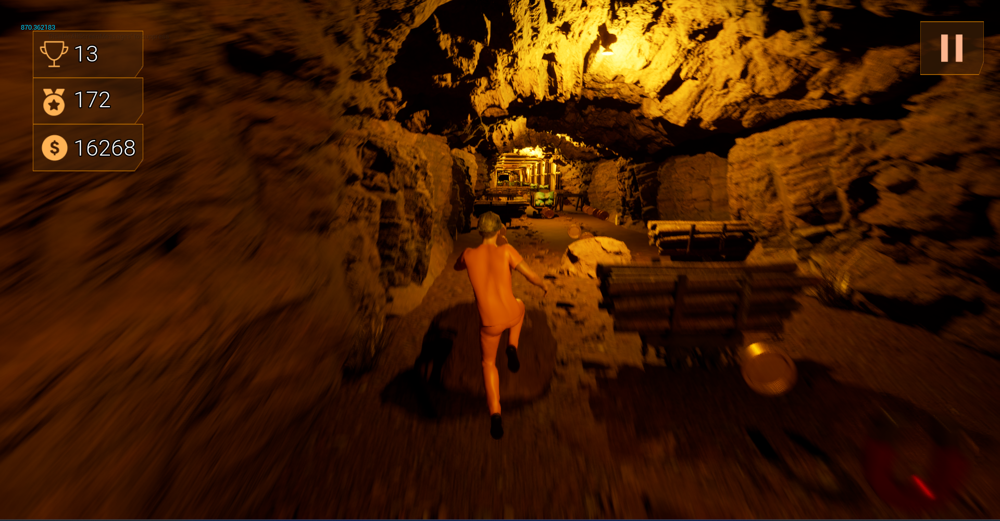
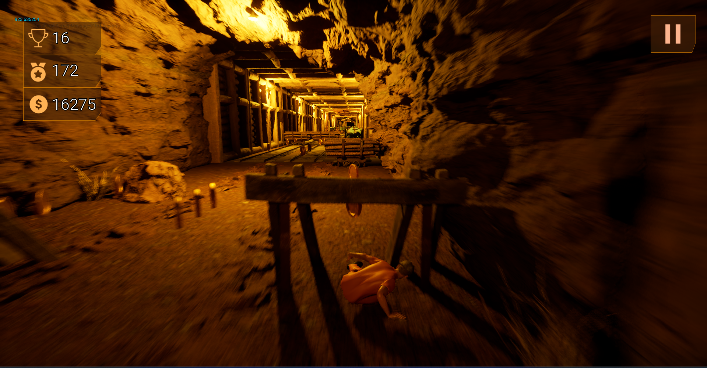
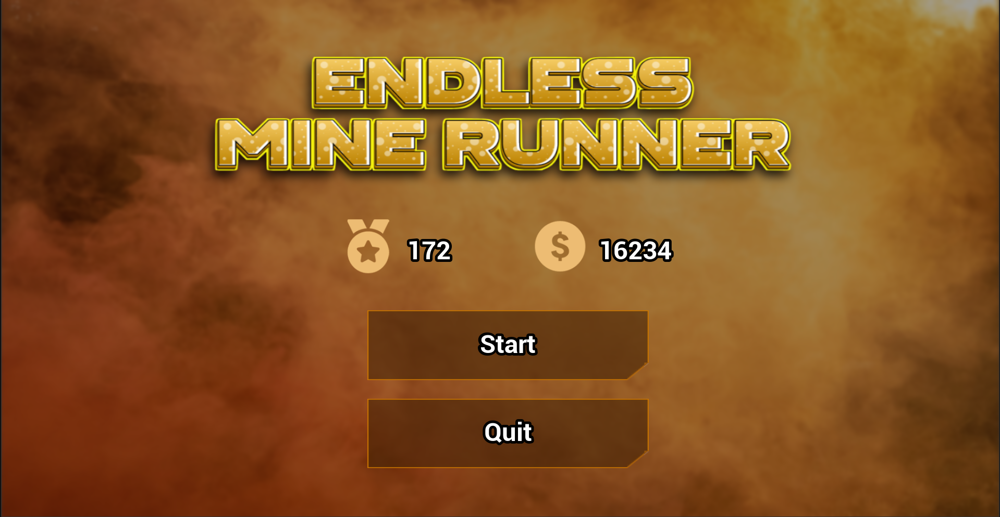
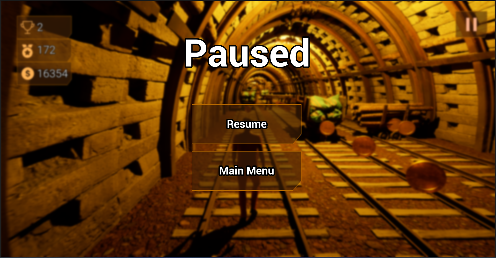
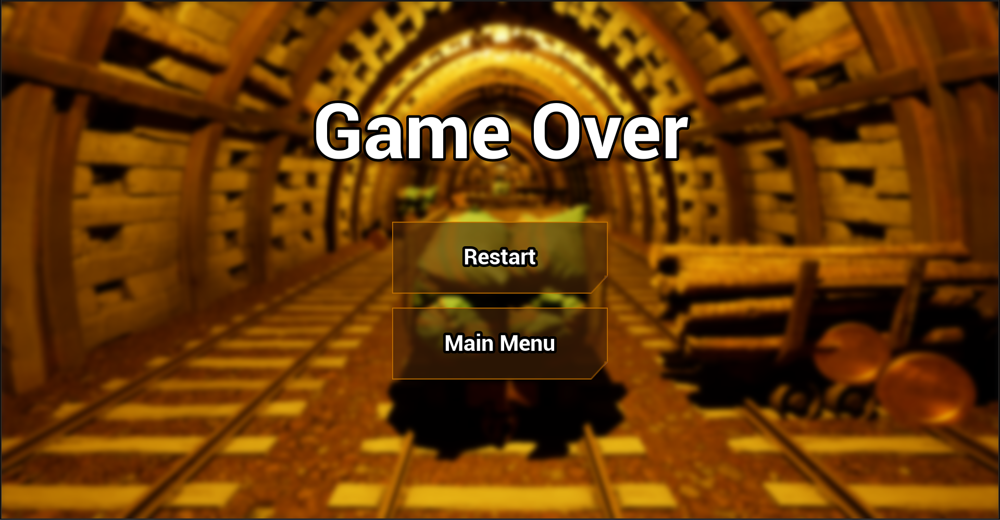

<h1 align="center">Endless Mine Runner</h1>
<h3><b>Endless Runner Game With Procedural Generation developed in Unreal Engine 5</b></h3> 

<li>Custom character and animations</li>
<li>Player and camera movement</li>
<li>Increasing player speed over time</li>
<li>4 different environments</li>
<li>Procedural generation of the level with obstacles, coins and magnet</li>
<li>Pause / Resume functionality</li>
<li>Tracking of high score and total coins collected</li>

  

    
Environment #1

       
    
Environment #2

       
    
Environment #3

       
    
Environment #4

       
    
Jumping animation

       
    
Sliding animation

       
    
Main Menu GUI

       
    
Pause Menu GUI

       
    
Game Over GUI

       

