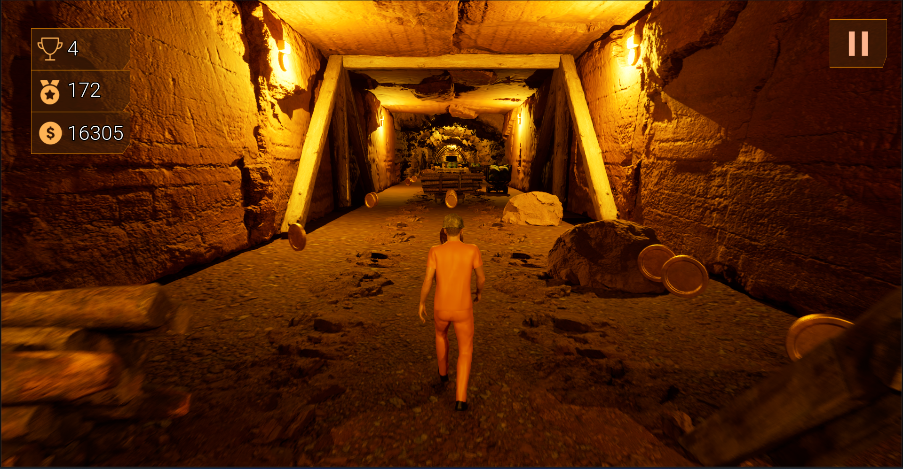
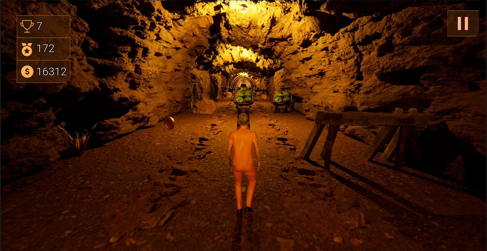
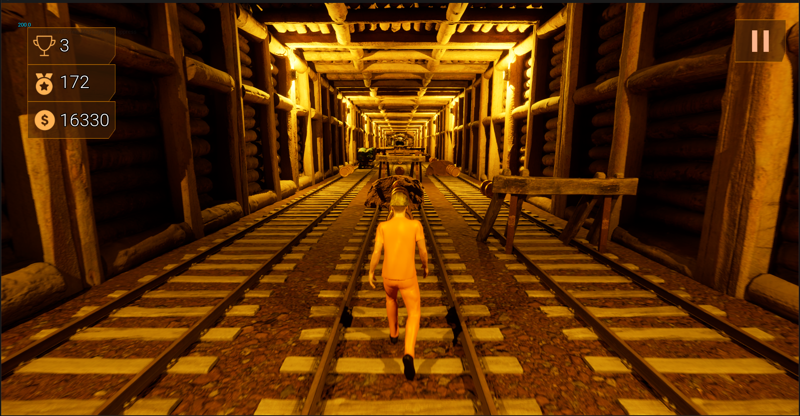
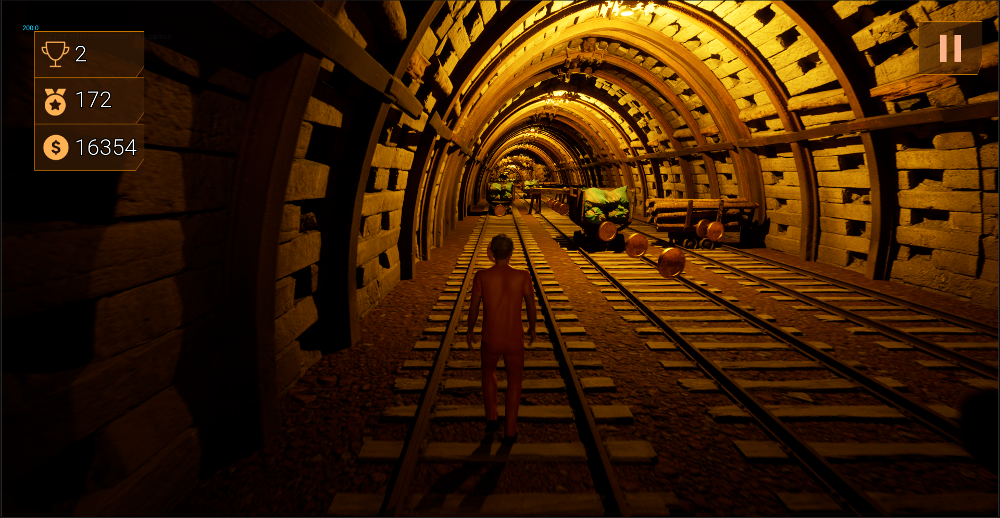
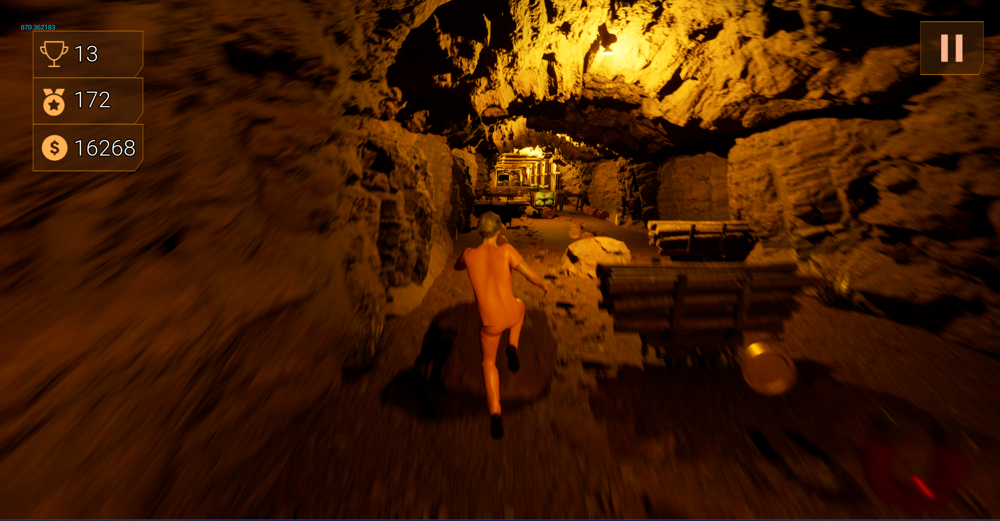
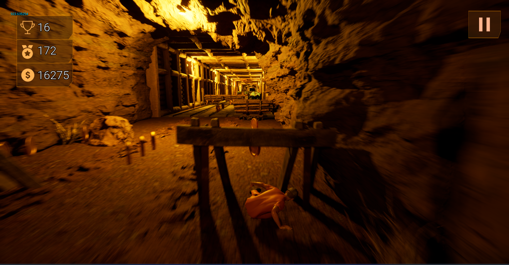
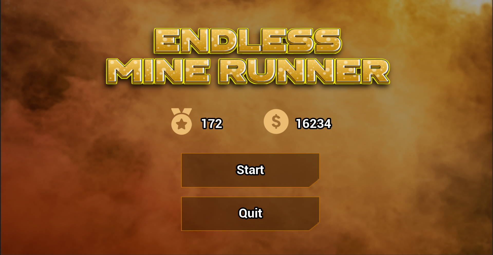
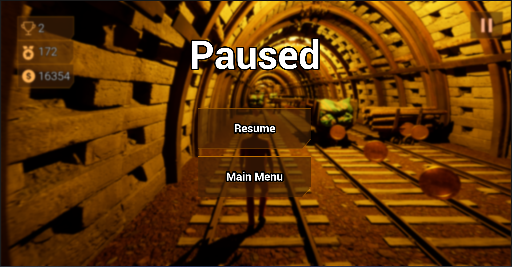
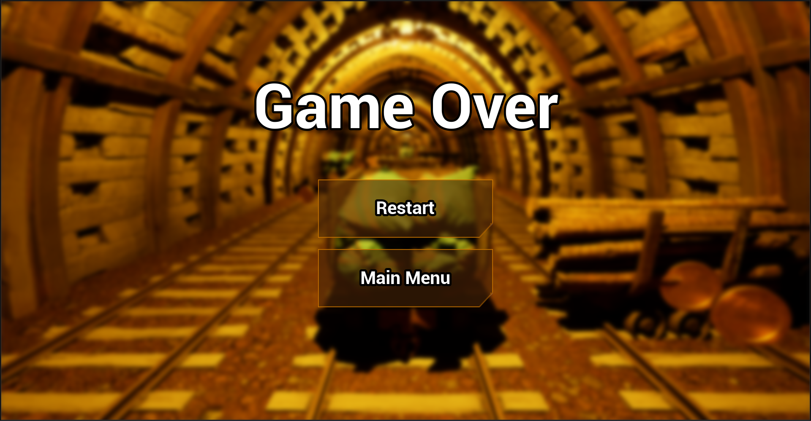

<h1 align="center">⛏️ Endless Mine Runner (Unreal Engine 5)</h1>

  An <b>Endless Runner</b> game with <b>procedural generation</b> built in <b>Unreal Engine 5</b>.  
  Run through mines, collect coins, and survive as long as you can while the speed keeps increasing!

---

<h2>🛠️ Technologies Used</h2>
<ul>
  <li><b>Unreal Engine 5</b> – Game engine and level design</li>
  <li><b>Blueprints</b> – Gameplay logic and procedural generation</li>
  <li><b>Custom Assets</b> – Character, animations, and environments</li>
</ul>

---

<h2>✨ Features</h2>
<ul>
  <li>🏃 <b>Endless Runner Gameplay</b> – Keep running while avoiding obstacles</li>
  <li>⛏️ <b>4 Unique Environments</b> – Mines, caves, and more</li>
  <li>⚡ <b>Progressive Difficulty</b> – Player speed increases over time</li>
  <li>🪙 <b>Coins & Magnet Power-Up</b> – Collect coins with optional magnet ability</li>
  <li>🛠️ <b>Procedural Generation</b> – Dynamic levels with random obstacles</li>
  <li>⏸️ <b>Pause & Resume</b> – Take a break anytime</li>
  <li>📊 <b>High Score Tracking</b> – Records best run and total coins collected</li>
</ul>

  

    
Environment #1

       
    
Environment #2

       
    
Environment #3

       
    
Environment #4

       
    
Jumping animation

       
    
Sliding animation

       
    
Main Menu GUI

       
    
Pause Menu GUI

       
    
Game Over GUI

       

